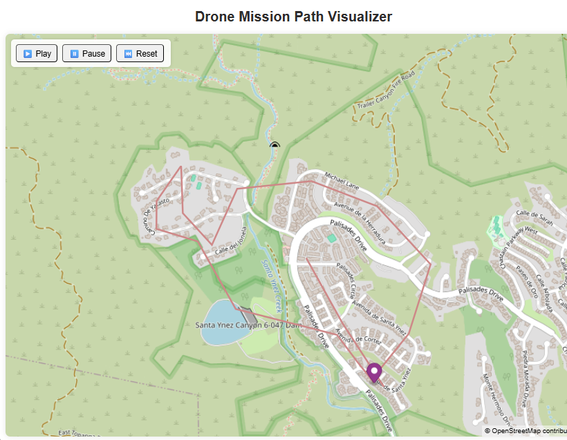

# Drone Trace & Mapping Platform

This project generates, visualizes, and stores GPS traces for an autonomous drone using an interactive map, geospatial database, and two backend services. To generate the digital elevation model (DEM), the opentopography api is used. The overpass api is used to generate the geospatial tile context and buildings. 

In addition to a robust frontend platform, data streaming, and real-time geospatial processing, this project includes my implementation of topography analytics, traveling salesman problem, and pathfinding algorithms for the drone flight.



## Tech Stack

- **Frontend**: Vite, MapLibre GL JS
- **Backend**:
  - `FastAPI`: Ingest GPS data via API
  - `Flask`: Serves the interactive map UI
- **Database**: TimescaleDB + PostGIS
- **Containerization**: Docker, Docker Compose

---

## Local Development

### Project Structure
├── flask_app/
├── fastapi_app/
├── db/
│ └── init.sql
├── docker-compose.yml
├── .env.example
└── README.md


### Requirements
- Docker & Docker Compose
- Python (optional if not using virtualenvs outside containers)

### Start the App

1. Copy the `.env.example`:
   ```bash
   cp .env.example .env

2. Run:
docker-compose up --build

3. Access:
* Flask app: http://localhost:8000
* FastAPI docs: http://localhost:8001/docs
* Postgres DB: localhost:5432 (via any SQL client)

4. Cloud Deployment:
For production, this architecture is compatible with:
* Kubernetes: Helm charts or K8s manifests (not included here)
* Terraform: For provisioning cloud databases, services, and secrets

This approach ensures separation between development and cloud-specific infrastructure.

5. Testing:
You can use the FastAPI Swagger UI at:
http://localhost:8001/docs

Screenshots


License: MIT